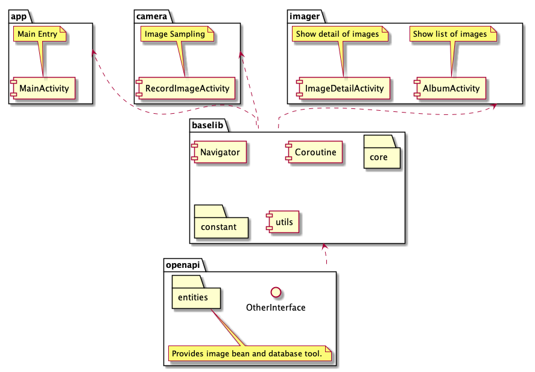

## Instruction

Before you read the following paragraphs, **make sure you are an Android developer**.  

Then you may start with the instruction of running this project.

#### Step 1.
Now as an Android developer, you may have set up an Android development   

environment on your computer with ***Android Studio***.  

You will need build-tools and API supports for ***Android 6 to 10***.  

And it's better to install one or two system images for ***x64*** platform   
for your ***AVD***.

After you installed all this supporting tools, you may start with ***Step 2***. 

#### Step 2.
Unzip the zip file, and delete the ***.idea*** directory under the project's   

root directory. And you will delete all ***.iml*** files.  

Then open your ***Android Studio*** android import this project as   

***Gradle Project***.   

After the synchronizing  process that you may build and run this project   

on devices with an Android support above ***level 24***.  

>***Question***: What if I have difficulty to get an Android development environment?  
***Answer***:There is a prebuilt apk file under the directory ***app/build/outputs/apk/debug/app-debug.apk***.

**You may find the user instruction for this project on the coding challenge handbook.   
Have fun !**

## Introduction
Saddly, for some reason, the will be no modifying history on github.  

So I would have to explain how I finished this demo.

At the very beginning, I was not sure about how many third-party   

components or tools I could use in this programme. So I passed   

third-party dependencies,such as ***RxJava, Dagger and Databinding***.  

But I kept ***Fresco*** and ***Room*** for building database tools and image caching  

tools. Otherwise, it will cost a lot.  

I devided this App into three modules by functions.  

**app** module is the main module, and it provide an entry activity for   

functions.  

**camera** module is the the module which provides the functions of image  

 sampling, image naming, image storing and image history storing. It   
 
contains only on activity.   

>note:I added an ***discard*** button for deleting the temporary image   

if user do not want to save the image.  

**imager** module is the module which provides the functions of image  

 list checking and image browsing. So it contains two activities.  
 
**You may not use dynamic feature modules in China, so these three "modules"  

are actually not modules but libraries.  **  
 
Besides functional modules, I provides two base libraries which providing   

basic functions and base classes.  

**baselib** is the library provides the base function of activity,asynchronized   

tasks and navigation.
**openapi** is the library provides general data models and essential  

 communication   interfaces between modules.  
 
**Here is the outline of this project:**  

There was something wrong with the configuration of AndroidTest, and I have not   

looked into it. so there is no unit test at all.
## Coroutine
I sealed an tool for launch an coroutine task becasue the orginal usage is  

too complex. A normal methdo could not call a **suspend method** directly.  

 This tool could launch an coroutine task by simply doing this:  
 
`future{  
    [here is your code]
}`  

And I write a ***next*** method to fake it into a stream tool.  So you   

may see codes like this:  

`future{ [step1]}.next{ [step2] } `  

The tool is in package ***com.example.baselib.coroutine***

## Navigator
The navigation between pages is based on **Deeplink**. The reason it is designed   

this way is that it is an reservation for the furture modularization work.  

Invoking pages with uri link will remove the dependency of knowing the name   

of the page you are going to launch. Parameters should be transmitted in  

the form of query parameter. 
This tool is in package ***com.example.baselib.navigator***

## Todo List
Here are some issues that I have located and need to be sold in the this project so far.   
+ Coroutine tools does not provide a delay function.  
+ Data and processing logic are encapsuled in Activity which makes the codes difficult to read.  
+ Permission should be managed by modules. In current version, they are requested by   click the buttons on the entry page. It may interupt the modularization.  
+ May we should try dagger and MVP design patten.  
+ And base class could be replaced by generated code created by written  annotation   processors.
+ Image has not been compressed.
+ There is no thumbnail for images, which slows its processing speed.
+ Image list should be paged.
+ Having not checked whether there are memory leaks.
+ The dependencies' versions claimed in modules should be managed by a unique setting file.
+ File processing functions should be sealed into one utility class.
+ File processing may cause a memory leak.  
+ Maybe we should try eventbus later.
+ The framework base on base classed is not flexible right now.
+ Used deprecated methods.
+ AndroidTest is not working.
+ After finishing taking picture, a FileObserver should be set in case the camere  process has not finished file writing.